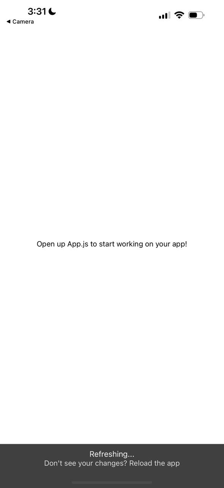

# Overview

This is a test repository, so feel free to experiment with git, JSX, React Native and Expo here.

# Requirements

1. You guys will need to download [NodeJS](https://nodejs.org/en). The current LTS version should be 20.11.0, just install that.
2. Install [Expo Go](https://expo.dev/client) on your devices as well
3. Once NodeJS is installed, follow the [Expo Guide](https://docs.expo.dev/get-started/installation/) on installing and setting up the Expo development environment. You should see this image

# Simple error checking to ensure everything is working
